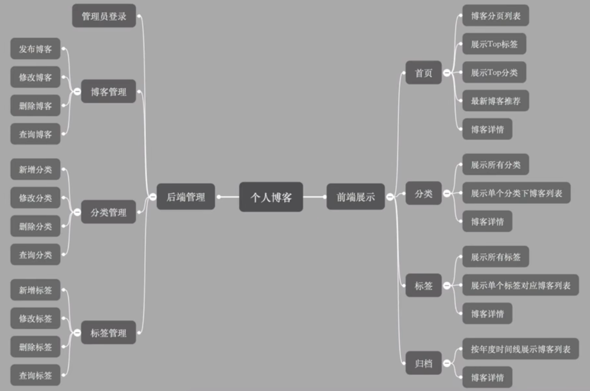

# 基于SpringBoot开发的个人博客
> **作者：** Cananoo

---

## 1. 需求与功能

### 1.1 用户故事  

角色：**普通访客**，**管理员（我）**

#### 访客

- 翻阅博客：
  - 分页查看所有的博客
  - 快速查看博客数最多的6个分类
  - 查看所有的分类
  - 查看某个分类下的博客列表
  - 快速查看标记博客最多的10个标签
  - 查看所有的标签
  - 查看某个标签下的博客列表
  - 根据年度时间线查看博客列表
  - 快速查看最新的推荐博客
  - 用关键字全局搜索博客
  - 查看单个博客内容
  - 对博客内容进行评论
  - 赞赏博客内容
  - 微信扫码阅读博客内容
  - 在首页扫描公众号二维码关注我

#### 管理员（我）

- 登录后台管理
- 管理博客：
  - 发布新博客
  - 对博客进行分类
  - 对博客打标签
  - 修改博客
  - 删除博客
  - 根据标题，分类，标签查询博客
- 管理博客分类：
  - 新增一个分类
  - 修改一个分类
  - 删除一个分类
  - 根据分类名称查询分类
- 管理标签：
  - 新增一个标签
  - 修改一个标签
  - 删除一个标签
  - 根据名称查询标签

### 1.2 功能规划

